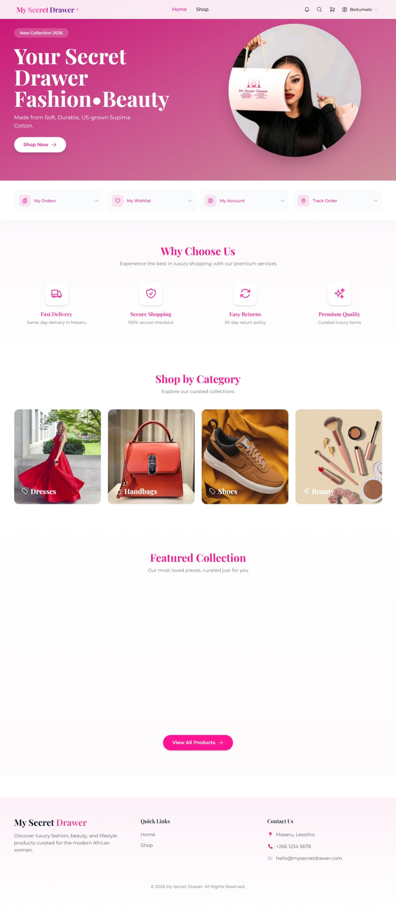
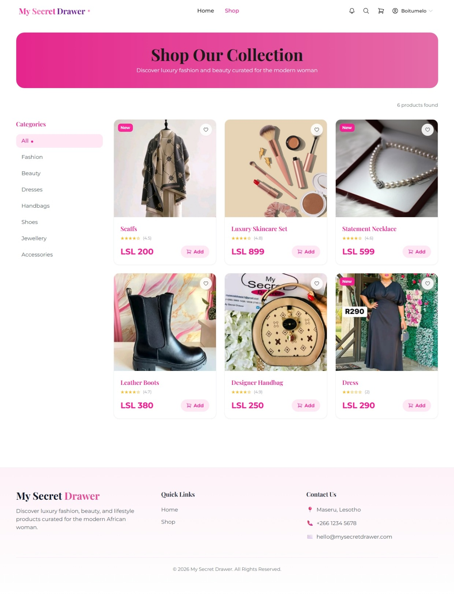
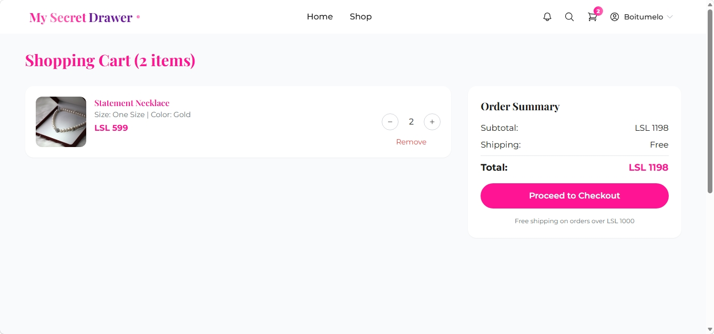
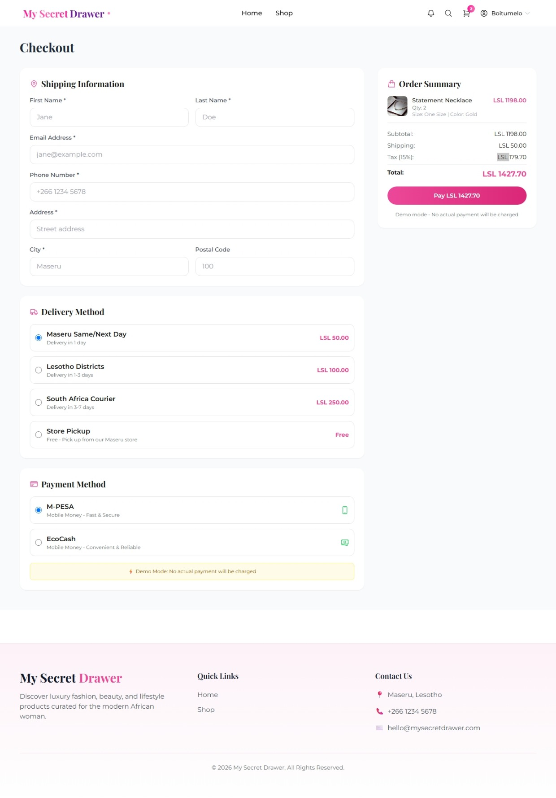
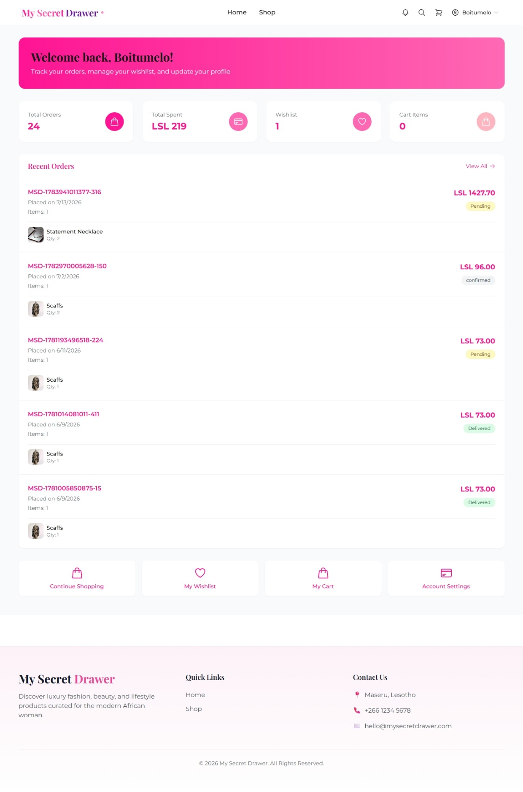
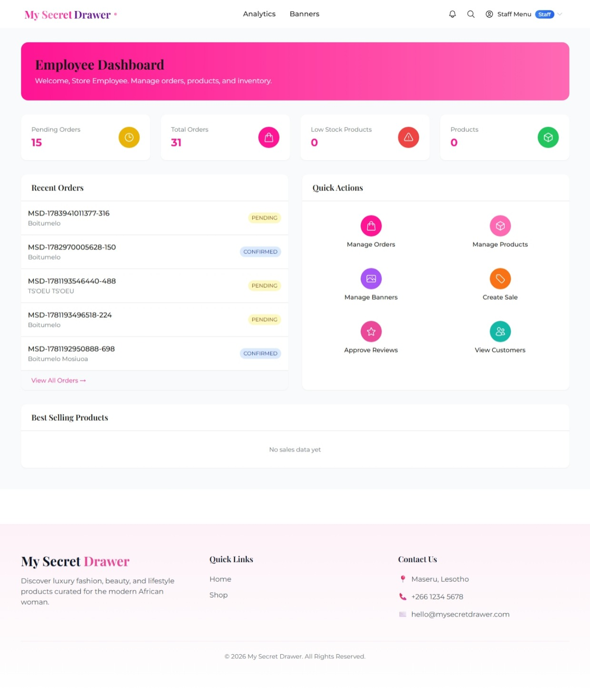
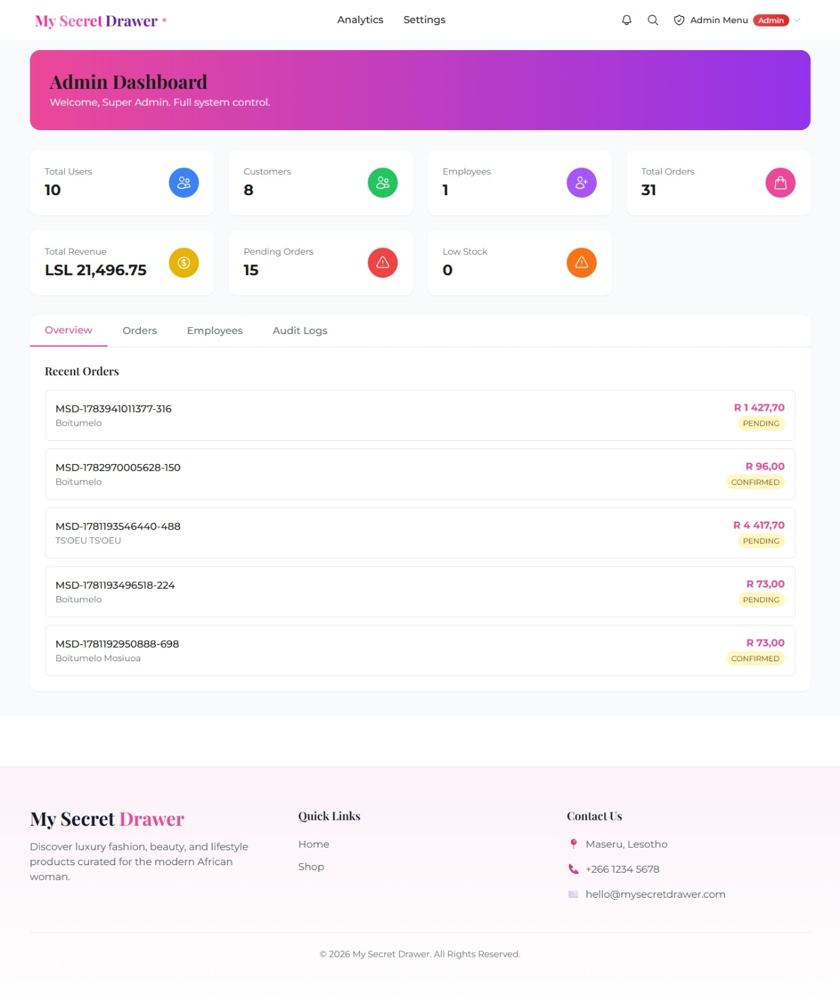
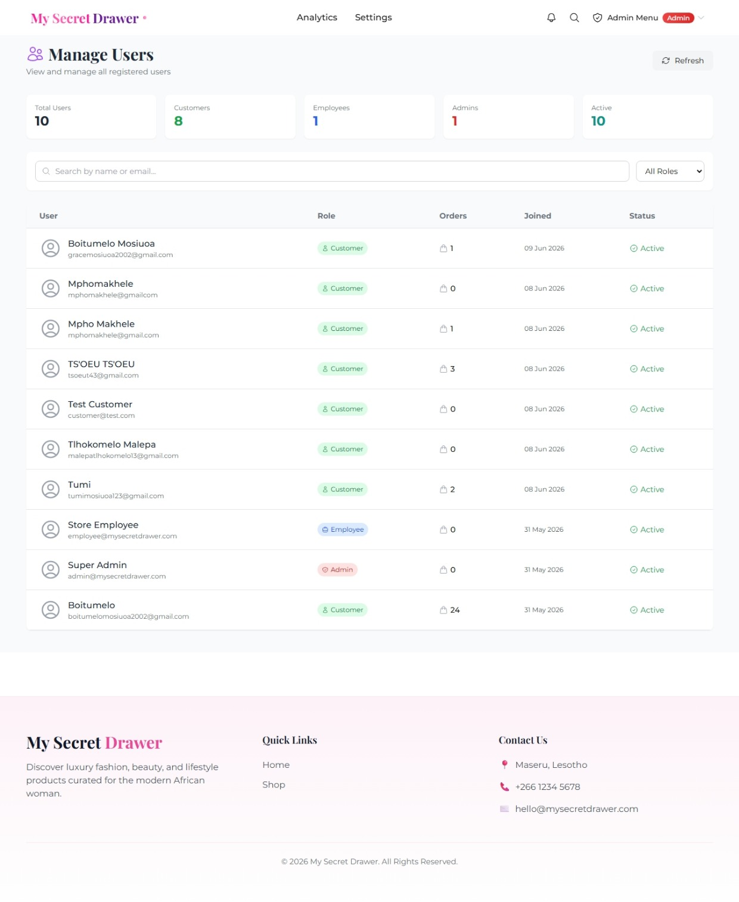
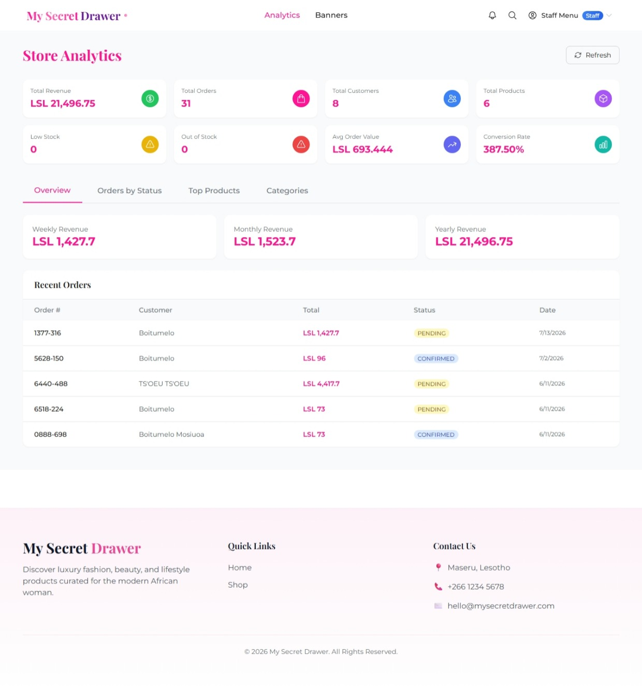
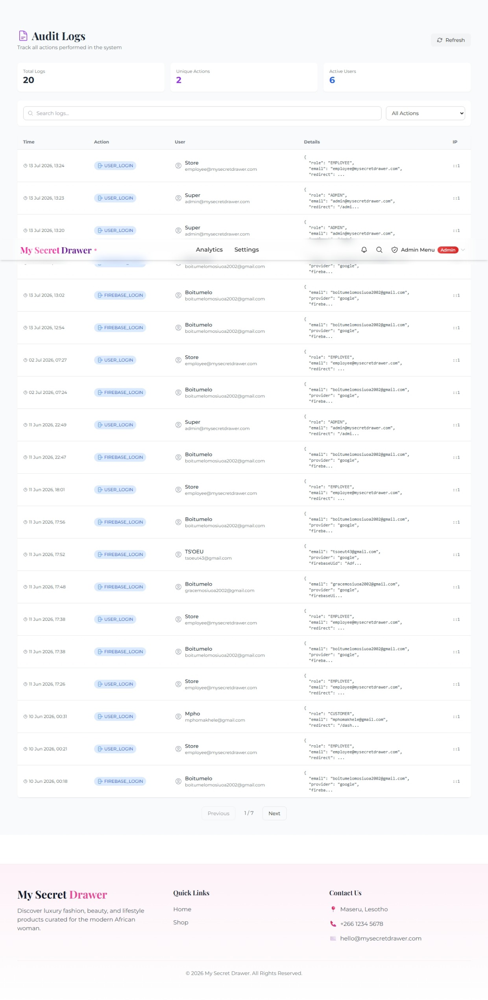

# My Secret Drawer

A full-stack luxury fashion and beauty e-commerce platform designed for customers in Lesotho and South Africa.

**Live Demo**  
https://my-secret-drawer.vercel.app/

**GitHub Repository**  
https://github.com/Boitumelo-bit/my-secret-drawer

---

# About The Project

My Secret Drawer is a modern full-stack e-commerce platform developed to provide a premium online shopping experience for fashion and beauty products.

The platform enables customers to browse products, manage shopping carts, save products to wishlists, securely authenticate, place orders, track deliveries, and manage their accounts.

The system also provides dedicated dashboards for employees and administrators, allowing efficient management of products, inventory, customers, orders, analytics, reviews, refunds, and system settings.

The application follows a modern client-server architecture using:

- React.js for the frontend
- Express.js and Node.js for backend services
- Prisma ORM for database management
- PostgreSQL hosted on Neon Database


---

# Key Highlights

- Fully responsive design
- Mobile-first user interface
- Firebase Authentication integration
- Email and Password authentication
- Google Sign-In
- Facebook Sign-In
- JWT authorization
- Role-based access control
- Customer dashboard
- Employee dashboard
- Administrator dashboard
- Shopping cart system
- Wishlist functionality
- Product reviews and ratings
- Order tracking
- Email notifications
- RESTful API architecture
- PostgreSQL database
- Cloudinary image management
- Vercel deployment


---

# Features

## Customer Features

- User registration and login
- Firebase authentication
- Google authentication
- Facebook authentication
- Browse fashion and beauty products
- Product categories
- Product search
- Product filtering
- Product details with images
- Product sizes and colours
- Shopping cart management
- Wishlist management
- Checkout process
- Order placement
- Order tracking
- Account management
- Product reviews
- Email notifications


---

## Employee Features

- Employee dashboard
- Order management
- Product management
- Inventory management
- Customer management
- Banner management
- Sales monitoring
- Refund processing
- Review moderation
- Analytics dashboard


---

## Administrator Features

- Administrator dashboard
- User management
- Employee management
- Product management
- Order monitoring
- Revenue tracking
- Analytics reports
- Audit logs
- System configuration
- Platform administration


---

# Technology Stack

## Frontend

- React.js
- Vite
- React Router
- Tailwind CSS
- Axios
- Framer Motion
- Swiper.js
- React Hot Toast
- Firebase Authentication


## Backend

- Node.js
- Express.js
- Prisma ORM
- JWT Authentication
- Socket.io
- Bcrypt


## Database

- PostgreSQL
- Neon Database


## Cloud Services

- Vercel
- Cloudinary
- Firebase


---

# System Architecture

The system follows a three-tier architecture.

## Presentation Layer

Responsible for the user interface and client-side interactions.

Technologies:

- React.js
- Tailwind CSS
- React Router
- Context API


## Business Logic Layer

Responsible for API processing, authentication, and application logic.

Technologies:

- Node.js
- Express.js
- REST API
- JWT Authentication
- Firebase Authentication
- Prisma ORM


## Data Layer

Responsible for data storage and management.

Technologies:

- PostgreSQL
- Prisma ORM
- Neon Database


---

# Database Design

The system contains the following main entities:

- Users
- Products
- Categories
- Orders
- Order Items
- Cart Items
- Wishlist
- Payments
- Reviews
- Notifications
- Addresses
- Coupons
- Loyalty Points
- Audit Logs
- Sessions
- Refunds
- Shipping Zones
- Product Views
- Search Logs
- Banners


---

# Authentication and Security

My Secret Drawer uses Firebase Authentication together with JWT authorization to provide secure user authentication.

Supported authentication methods:

- Email and Password Authentication
- Google Sign-In
- Facebook Sign-In


Security features:

- Firebase Authentication
- JWT-based authorization
- Password hashing using bcrypt
- Protected routes
- Role-based access control
- Secure REST APIs
- Session validation
- Audit logging


---

# Responsive Design

My Secret Drawer follows a mobile-first responsive design approach.

The application is optimized for:

- Mobile phones
- Tablets
- Laptops
- Desktop computers


Responsive layouts have been implemented across:

- Homepage
- Product pages
- Shopping cart
- Checkout
- Customer dashboard
- Employee dashboard
- Administrator dashboard


The interface automatically adapts navigation menus, product grids, forms, images, and dashboards according to screen size.


---

# Screenshots

## Customer Interface

### Homepage




### Product Browsing




### Product Details


### Shopping Cart




### Checkout




### Customer Dashboard




---

# Mobile Responsive Views

The platform provides a responsive experience across mobile devices.

### Mobile Shopping Cart

.png)


### Mobile Orders

.jpeg)


### Mobile Employee Dashboard

.jpeg)


### Mobile User Management

.png)


---

# Employee Dashboard Screenshots

### Employee Dashboard




### Inventory Management

.jpeg)


### Order Management

.jpeg)


---

# Administrator Dashboard Screenshots

### Administrator Dashboard




### User Management




### Analytics




### Audit Logs




---

# Installation and Setup

## Clone Repository

```bash
git clone https://github.com/Boitumelo-bit/my-secret-drawer.git

cd my-secret-drawer
